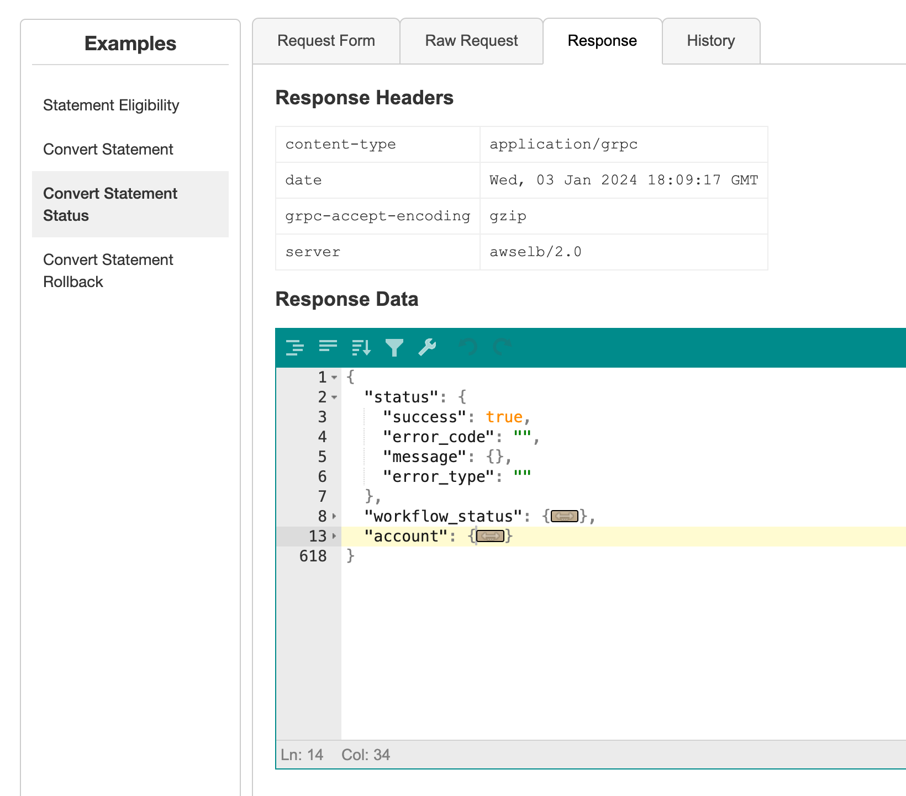

# dRPC UI

`drpcui` is a command-line tool that lets you interact with gRPC servers via a browser.
This is built on top of [grpcui](github.com/fullstorydev/grpcui) with additional features.

## Features
Along with features of `grpcui` this tool also supports:

1. Auto enable Int and String Fields when clicked on. 
2. DateTimes default to current time. 
3. Title of new tabs will be the target url.
4. Grpc controller name is automatically populated in the descriptions which can be directly used in locksmith.
5. Add support for Json Editor in Request and Response Screen 
   1. Formatting Json (Ctrl + I)
   2. Compacting Json (Ctrl + Shift + I)
   3. Filter, Sorting and Transforming 
   4. Repair JSON: fix quotes and escape characters, remove comments and JSONP notation, turn JavaScript objects into JSON. 
   5. Undo and Redo (Ctrl + Z, Ctrl + Shift + Z)

## Installation

### Homebrew (MacOS or Linux)
Install with `homebrew`:
```shell
brew tap heysachin/drpcui
brew install drpcui
```

### From Source
You can use the `go` tool to install `drpcui`:
```shell
go install github.com/heysachin/drpcui/cmd/drpcui@latest
```

This installs the command into the `bin` sub-folder of wherever your `$GOPATH`
environment variable points. If this directory is already in your `$PATH`, then
you should be good to go.

If you have already pulled down this repo to a location that is not in your
`$GOPATH` and want to build from the sources, you can `cd` into the repo and then
run `make install`.

If you encounter compile errors, you could have out-dated versions of `drpcui`'s
dependencies. You can update the dependencies by running `make updatedeps`.

### Running without install 

```
go run ./cmd/drpcui/grpcui.go -plaintext localhost:9019
```

## Usage
The usage doc for the tool explains the numerous options:
```shell
drpcui -help
```

Most of the flags control how the program connects to the gRPC server that to which
requests will be sent. However, there is one flag that controls `drpcui` itself: the
`-port` flag controls what port the HTTP server should use to expose the web UI. If
no port is specified, an ephemeral port will be used (so likely a different port each
time it is run, allocated by the operating system).

### Web Form
When you run `drpcui`, it will show you a URL to put into a browser in order to access
the web UI.

```
$ drpcui -plaintext localhost:12345
gRPC Web UI available at http://127.0.0.1:60551/...

```

### Updated Raw Request JSON
The second tab lets you view the JSON representation of the request data you have defined on the
first tab. You can also directly edit the JSON data -- including pasting in an entire JSON message.

The JSON representation uses the standard [JSON mapping for Protocol Buffers](https://developers.google.com/protocol-buffers/docs/proto3#json).

<p align="center">
  
</p>

When working with an RPC that has a streaming request, the JSON data will be a JSON array, where
each element is a single message in the stream.

### Updated Responses

<p align="center">
  
</p>
